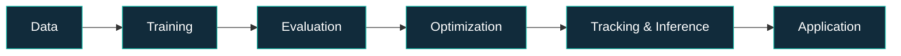

<!--
  AliRezaKhatibi | GitHub Profile README
  Verified focus: aerial vision, real-time tracking, data science, research engineering.
  The RECENT_REPOS and ALL_REPOS sections are maintained by GitHub Actions.
-->

  

   

  
  
  
  

    

  

---

## 👨‍💻 About me

I'm **AliReza Khatibi**, an AI researcher and developer focused on the intersection of **deep learning**, **computer vision**, and **real-world AI systems**. I work across the research-to-application pipeline: designing experiments, evaluating models, optimizing inference, and building interfaces that make intelligent systems usable.

- 🔭 **Current focus:** detecting tiny people in aerial imagery, multi-object tracking, robust identity association, and practical real-time inference.
- 🧪 **Research toolkit:** controlled experiments, reproducible benchmarks, detection/tracking metrics, and accuracy–latency trade-offs.
- 🛠️ **Beyond notebooks:** desktop tools, data quality workflows, model deployment, and AI-driven applications.
- 🤝 **Team:** XVARNA · open to research and engineering collaboration.

## ✨ Featured work

<table>
  <tr>
    <td width="50%" valign="top">
      <h3>🚁 <a href="https://github.com/AliRezaKhatibi/real-time-aerial-human-detection-tracking">Aerial Detection & Tracking</a></h3>
      
An end-to-end research and engineering framework for aerial human detection, multi-object tracking, inference optimization, and desktop integration.

      
<code>YOLO26s</code> <code>RT-DETR</code> <code>ByteTrack</code> <code>BoT-SORT</code> <code>TensorRT</code>

      
    </td>
    <td width="50%" valign="top">
      <h3>🎯 <a href="https://github.com/AliRezaKhatibi/aerial-human-detection">Aerial Human Detection</a></h3>
      
Research-oriented human detection in UAV footage, with attention to tiny objects, camera motion, high-resolution imagery, and tracking workflows.

      
<code>Computer Vision</code> <code>Small Objects</code> <code>PyTorch</code> <code>UAV</code>

      
    </td>
  </tr>
  <tr>
    <td width="50%" valign="top">
      <h3>🧹 <a href="https://github.com/AliRezaKhatibi/GREEN-Pro">GREEN Pro</a></h3>
      
An offline Python desktop application for CSV data health checks, cleaning, visualization, dataset comparison, and HTML reporting.

      
<code>Python</code> <code>Pandas</code> <code>Tkinter</code> <code>EDA</code>

      
    </td>
    <td width="50%" valign="top">
      <h3>🧠 <a href="https://github.com/AliRezaKhatibi/15-Class-CNN-Classifier">15-Class CNN Classifier</a></h3>
      
An image classification project built around EfficientNetB0 transfer learning, preprocessing, and model evaluation.

      
<code>EfficientNetB0</code> <code>TensorFlow</code> <code>Keras</code>

      
    </td>
  </tr>
  <tr>
    <td width="50%" valign="top">
      <h3>🚢 <a href="https://github.com/AliRezaKhatibi/titanic-survival-prediction">Titanic Survival Prediction</a></h3>
      
An end-to-end tabular ML project with feature engineering, model comparisons, tuning, and evaluation.

      
<code>Scikit-learn</code> <code>XGBoost</code> <code>Random Forest</code>

      
    </td>
    <td width="50%" valign="top">
      <h3>📐 <a href="https://github.com/AliRezaKhatibi/Regression-Models">Regression Models</a></h3>
      
Notebooks and learning material covering linear, multivariate, polynomial, and regularized regression approaches.

      
<code>Machine Learning</code> <code>Statistics</code> <code>Jupyter</code>

      
    </td>
  </tr>
</table>

## ⚙️ Technology & research stack

  

| Focus | Technologies & concepts |
|:--|:--|
| **AI & deep learning** | Python · PyTorch · TensorFlow / Keras · Scikit-learn · XGBoost |
| **Computer vision** | OpenCV · YOLO · RT-DETR · EfficientNet · multi-object tracking |
| **Inference & evaluation** | ONNX Runtime · TensorRT · FP16 · detection metrics · tracking metrics |
| **Applications & tooling** | FastAPI · React / TypeScript · Tauri / Rust · Tkinter · Docker · Jupyter |
| **Data & visualization** | Pandas · NumPy · Matplotlib · exploratory data analysis |

## 🔬 From experiment to application

> My goal is to build AI that is not just accurate in an experiment, but also measurable, efficient, and useful outside the notebook.

## 🕘 Recently updated repositories

<!-- RECENT_REPOS:START -->
_This section is populated from public repository push timestamps when the included GitHub Actions workflow runs._

[See all recent activity on GitHub →](https://github.com/AliRezaKhatibi)
<!-- RECENT_REPOS:END -->

## 🗂️ Complete repository directory

<!-- ALL_REPOS:START -->

<b>Explore my repositories (automatically refreshable)</b>

The following repositories have been individually verified; **the included updater fills in the entire current public repository list automatically** on its first run.

| Repository | Focus |
|:--|:--|
| [real-time-aerial-human-detection-tracking](https://github.com/AliRezaKhatibi/real-time-aerial-human-detection-tracking) | Aerial detection, tracking, optimized inference |
| [aerial-human-detection](https://github.com/AliRezaKhatibi/aerial-human-detection) | Tiny-person aerial computer vision |
| [GREEN-Pro](https://github.com/AliRezaKhatibi/GREEN-Pro) | Offline data quality and EDA application |
| [15-Class-CNN-Classifier](https://github.com/AliRezaKhatibi/15-Class-CNN-Classifier) | EfficientNetB0 image classification |
| [titanic-survival-prediction](https://github.com/AliRezaKhatibi/titanic-survival-prediction) | Tabular machine-learning pipeline |
| [Regression-Models](https://github.com/AliRezaKhatibi/Regression-Models) | Regression notebooks |
| [Digital-image-processing](https://github.com/AliRezaKhatibi/Digital-image-processing) | Digital image processing |
| [transition-probability-matrix](https://github.com/AliRezaKhatibi/transition-probability-matrix) | Markov transition matrices |
| [AliRezaKhatibi](https://github.com/AliRezaKhatibi/AliRezaKhatibi) | Profile README |

**[Browse the full, always-current list on GitHub →](https://github.com/AliRezaKhatibi?tab=repositories)**

<!-- ALL_REPOS:END -->

## 📊 GitHub insights

  
  

  

These visualizations are supplied by third-party services and may occasionally be unavailable. Language breakdowns reflect repository contents, not personal proficiency.

---

  <h3>🤝 Research · Build · Collaborate</h3>
  
Interested in computer vision research, model evaluation, applied AI, or intelligent software?

  
  
    
  Built with curiosity · Backed by experiments · Updated from GitHub

