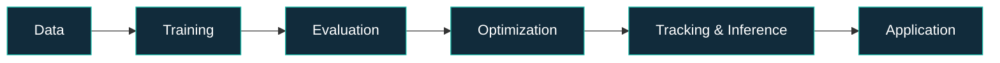

<!--
  AliRezaKhatibi | GitHub Profile README
  Focus: AI Research, Deep Learning, Computer Vision,
  Aerial Detection, Multi-Object Tracking & Applied AI.

  RECENT_REPOS and ALL_REPOS are maintained by GitHub Actions.
-->

  

   

  

  

  

  

    

  

---

## 👨‍💻 About Me

I'm **AliReza Khatibi**, an AI researcher and developer focused on the intersection of **deep learning**, **computer vision**, and **real-world AI systems**.

I work across the research-to-application pipeline: designing experiments, evaluating models, optimizing inference, and building interfaces that make intelligent systems usable.

- 🔭 **Current Focus:** Detecting tiny people in aerial imagery, multi-object tracking, robust identity association, and practical real-time inference.
- 🧪 **Research Toolkit:** Controlled experiments, reproducible benchmarks, detection and tracking metrics, and accuracy-latency trade-offs.
- 🛠️ **Beyond Notebooks:** Desktop tools, data quality workflows, model deployment, and AI-driven applications.
- 🤝 **Team:** XVARNA | Open to research and engineering collaboration.

---

## ✨ Featured Projects

<table>
  <tr>
    <td width="50%" valign="top">
      <h3>🚁 <a href="https://github.com/AliRezaKhatibi/real-time-aerial-human-detection-tracking">Aerial Detection & Tracking</a></h3>
      
An end-to-end research and engineering framework for aerial human detection, multi-object tracking, inference optimization, and desktop integration.

      

        <code>YOLO26s</code>
        <code>RT-DETR</code>
        <code>ByteTrack</code>
        <code>BoT-SORT</code>
        <code>TensorRT</code>
      

      
    </td>
    <td width="50%" valign="top">
      <h3>🎯 <a href="https://github.com/AliRezaKhatibi/aerial-human-detection">Aerial Human Detection</a></h3>
      
Research-oriented human detection in UAV footage, with attention to tiny objects, camera motion, high-resolution imagery, and tracking workflows.

      

        <code>Computer Vision</code>
        <code>Small Objects</code>
        <code>PyTorch</code>
        <code>UAV</code>
      

      
    </td>
  </tr>

  <tr>
    <td width="50%" valign="top">
      <h3>🧹 <a href="https://github.com/AliRezaKhatibi/GREEN-Pro">GREEN Pro</a></h3>
      
An offline Python desktop application for CSV data health checks, cleaning, visualization, dataset comparison, and HTML reporting.

      

        <code>Python</code>
        <code>Pandas</code>
        <code>Tkinter</code>
        <code>EDA</code>
      

      
    </td>
    <td width="50%" valign="top">
      <h3>🧠 <a href="https://github.com/AliRezaKhatibi/15-Class-CNN-Classifier">15-Class CNN Classifier</a></h3>
      
An image classification project built around EfficientNetB0 transfer learning, preprocessing, and model evaluation.

      

        <code>EfficientNetB0</code>
        <code>TensorFlow</code>
        <code>Keras</code>
      

      
    </td>
  </tr>

  <tr>
    <td width="50%" valign="top">
      <h3>🚢 <a href="https://github.com/AliRezaKhatibi/titanic-survival-prediction">Titanic Survival Prediction</a></h3>
      
An end-to-end tabular machine learning project with feature engineering, model comparisons, tuning, and evaluation.

      

        <code>Scikit-learn</code>
        <code>XGBoost</code>
        <code>Random Forest</code>
      

      
    </td>
    <td width="50%" valign="top">
      <h3>📐 <a href="https://github.com/AliRezaKhatibi/Regression-Models">Regression Models</a></h3>
      
Notebooks and learning material covering linear, multivariate, polynomial, and regularized regression approaches.

      

        <code>Machine Learning</code>
        <code>Statistics</code>
        <code>Jupyter</code>
      

      
    </td>
  </tr>
</table>

---

## ⚙️ Technology & Research Stack

  

| Focus | Technologies & Concepts |
|:--|:--|
| **AI & Deep Learning** | Python · PyTorch · TensorFlow / Keras · Scikit-learn · XGBoost |
| **Computer Vision** | OpenCV · YOLO · RT-DETR · EfficientNet · Multi-Object Tracking |
| **Inference & Evaluation** | ONNX Runtime · TensorRT · FP16 · Detection Metrics · Tracking Metrics |
| **Applications & Tooling** | FastAPI · React / TypeScript · Tauri / Rust · Tkinter · Docker · Jupyter |
| **Data & Visualization** | Pandas · NumPy · Matplotlib · Exploratory Data Analysis |

---

## 🔬 From Experiment to Application

> My goal is to build AI that is not just accurate in an experiment, but also measurable, efficient, and useful outside the notebook.

---

## 🕘 Recently Updated Repositories

<!-- RECENT_REPOS:START -->

_This section is populated from public repository push timestamps when the included GitHub Actions workflow runs._

[See all recent activity on GitHub →](https://github.com/AliRezaKhatibi)

<!-- RECENT_REPOS:END -->

---

## 🗂️ Complete Repository Directory

<!-- ALL_REPOS:START -->

  
<b>📂 Explore My Repositories (Automatically Refreshable)</b>

   

  The following repositories are included in the initial directory. The GitHub Actions updater can refresh this section with the complete public repository list.

  | Repository | Focus |
  |:--|:--|
  | [real-time-aerial-human-detection-tracking](https://github.com/AliRezaKhatibi/real-time-aerial-human-detection-tracking) | Aerial Detection, Tracking & Optimized Inference |
  | [aerial-human-detection](https://github.com/AliRezaKhatibi/aerial-human-detection) | Tiny-Person Aerial Computer Vision |
  | [GREEN-Pro](https://github.com/AliRezaKhatibi/GREEN-Pro) | Offline Data Quality & EDA Application |
  | [15-Class-CNN-Classifier](https://github.com/AliRezaKhatibi/15-Class-CNN-Classifier) | EfficientNetB0 Image Classification |
  | [titanic-survival-prediction](https://github.com/AliRezaKhatibi/titanic-survival-prediction) | Tabular Machine Learning Pipeline |
  | [Regression-Models](https://github.com/AliRezaKhatibi/Regression-Models) | Regression Notebooks |
  | [Digital-image-processing](https://github.com/AliRezaKhatibi/Digital-image-processing) | Digital Image Processing |
  | [transition-probability-matrix](https://github.com/AliRezaKhatibi/transition-probability-matrix) | Markov Transition Matrices |
  | [AliRezaKhatibi](https://github.com/AliRezaKhatibi/AliRezaKhatibi) | GitHub Profile README |

   

  **[Browse All My Public Repositories →](https://github.com/AliRezaKhatibi?tab=repositories)**

<!-- ALL_REPOS:END -->

---

## 📊 GitHub Insights

  

  

 

  <h3>📈 GitHub Contribution Activity</h3>

  

 

  

  

 

GitHub statistics are provided by third-party services and may occasionally be unavailable. Programming language distributions reflect repository content, not personal proficiency.

---

## 🤝 Research · Build · Collaborate

  <h3>Let's Build Intelligent Systems Together</h3>

  

    Interested in computer vision research, model evaluation,
    applied AI, or intelligent software development?
  

  

  

    

  
    Built with curiosity · Backed by experiments · Updated from GitHub
  

